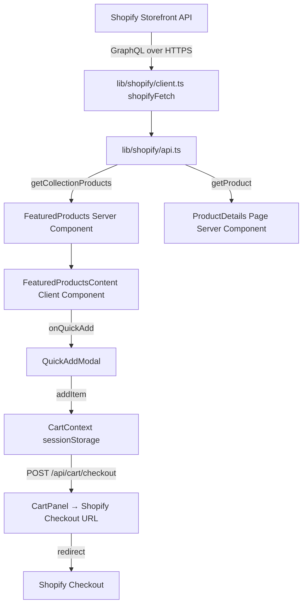

# BOINNG! Codebase Analysis

## Overview

**BOINNG!** is a Next.js 16 (App Router) e-commerce storefront for an Indian streetwear brand, wired directly to Shopify's **Storefront GraphQL API**. There is no custom backend — all product, collection, and cart data flows through Shopify.

---

## Tech Stack

| Layer | Choice |
|---|---|
| Framework | Next.js 16 (App Router, React 19) |
| Language | TypeScript 5 |
| Styling | TailwindCSS 3 + custom design tokens |
| Animation | Framer Motion 12 |
| Icons | Lucide React |
| Data | Shopify Storefront API 2024-01 (GraphQL) |
| Fonts | **Roketto** (display), **Gilroy** (body) — self-hosted |
| Deployment | Vercel (ISR, 60s revalidation) |

---

## Directory Structure

```
Boinng/
├── app/                        # Next.js App Router
│   ├── layout.tsx              # Root layout (CartProvider, Navbar, Footer)
│   ├── page.tsx                # Homepage
│   ├── globals.css             # Global styles, font faces, CSS variables
│   ├── api/cart/checkout/      # API route: create Shopify checkout
│   ├── collections/[handle]/   # Collection page (dynamic)
│   ├── products/[handle]/      # Product detail page (dynamic)
│   └── pages/                  # Static info pages
│       ├── contact/
│       ├── privacy/
│       ├── returns/
│       ├── shipping/
│       └── terms/
├── components/
│   ├── home/                   # Homepage sections
│   │   ├── Hero.tsx            # Video hero with parallax
│   │   ├── FeaturedProducts.tsx       # Server component (fetches collection)
│   │   ├── FeaturedProductsContent.tsx # Client component (renders cards + QuickAdd)
│   │   ├── Features.tsx        # "Built on Quality" section
│   │   ├── Testimonials.tsx    # Social proof
│   │   ├── InstagramFeed.tsx   # Instagram feed section
│   │   ├── FinalCTA.tsx        # Bottom CTA
│   │   ├── BrandStory.tsx      # About / brand story
│   │   └── ShopTheLook.tsx     # Shop-the-look feature (not used on homepage)
│   ├── layout/
│   │   ├── Navbar.tsx          # Sticky navbar (glass blur on scroll)
│   │   ├── AnnouncementBar.tsx # Animated top bar
│   │   ├── Footer.tsx          # Full footer with newsletter, links
│   │   ├── Marquee.tsx         # Scrolling ticker
│   │   └── MobileMenu.tsx      # Full-screen mobile menu
│   ├── cart/
│   │   └── CartPanel.tsx       # Slide-in cart drawer
│   ├── product/
│   │   ├── ProductDetails.tsx     # Full PDP view (image gallery, variants, ATC)
│   │   ├── ProductDetailsNew.tsx  # Variant PDP (unused/WIP)
│   │   └── QuickAddModal.tsx      # Quick-add modal from product cards
│   └── ui/
│       ├── Button.tsx          # Reusable button component
│       └── ReadMore.tsx        # Expandable text component
├── lib/
│   ├── shopify/
│   │   ├── client.ts           # shopifyFetch() — generic Storefront API caller
│   │   ├── queries.ts          # All GraphQL queries + cart mutations
│   │   ├── api.ts              # getCollectionProducts(), getProduct(), transformProduct()
│   │   └── types.ts            # All TypeScript types (Product, Cart, Variant, etc.)
│   ├── cart/
│   │   └── context.tsx         # React Context cart state (sessionStorage persistence)
│   ├── cn.ts                   # Tailwind class merge utility (clsx + tailwind-merge)
│   └── utils.ts                # formatMoney(), getVariants(), findVariantByOptions()
├── public/
│   ├── hero.mp4 / hero1.mp4 / herolong.mp4   # Hero videos
│   ├── fonts/                  # Roketto.ttf, Gilroy-*.ttf
│   └── logos/                  # Brand logo variants
├── scripts/
│   └── test-shopify.js         # Manual Shopify API connection test
└── tailwind.config.ts          # Custom design tokens
```

---

## Data Flow



### Key Data Flow Notes
- **[FeaturedProducts](file:///d:/Boinng/tying/Boinng/components/home/FeaturedProducts.tsx#10-22)** is a **Server Component** — it fetches from Shopify at render time with ISR (60s revalidation). It passes plain `Product[]` down to [FeaturedProductsContent](file:///d:/Boinng/tying/Boinng/components/home/FeaturedProductsContent.tsx#108-165) (Client Component).
- **[transformProduct()](file:///d:/Boinng/tying/Boinng/lib/shopify/api.ts#90-175)** converts Shopify's nested edge/node GraphQL shape into a flat [TransformedProduct](file:///d:/Boinng/tying/Boinng/lib/shopify/types.ts#62-76) shape used by the UI.
- **Cart state** lives in React Context (`CartContext`) and is persisted to `sessionStorage` only — it is **not** synced to Shopify's Cart API in real-time. Checkout is created server-side via `/api/cart/checkout` when the user clicks "Checkout".

---

## Design System

| Token | Value |
|---|---|
| `boinng-bg` | `#FFFEFA` (off-white) |
| `boinng-black` | `#000000` |
| `boinng-yellow` | `#FCB116` |
| `boinng-blue` | `#1354e5` |
| `boinng-pink` | `#D70F59` |
| `font-display` | Roketto (all-caps, display headings) |
| `font-body` | Gilroy (all weights: 300–900) |

CSS selection highlight is yellow (`#FCB116`). All animations use **Framer Motion** with spring physics.

---

## Homepage Composition ([app/page.tsx](file:///d:/Boinng/tying/Boinng/app/page.tsx))

```
<Hero />            ← Video hero with parallax fade-out on scroll
<Marquee />         ← Scrolling ticker at default speed
<FeaturedProducts   ← "BEST SELLERS" collection (Shopify)
<FeaturedProducts   ← "NEW ARRIVALS" collection (Shopify)
<Features />        ← "Built on Quality & Integrity" section
<Marquee dark />    ← Dark ticker with brand slogans
<InstagramFeed />   ← Instagram social proof
<Testimonials />    ← Customer testimonials
<FinalCTA />        ← Bottom CTA before footer
```

---

## Cart Architecture

The cart is a **client-side only, context-based** implementation:

- **`CartContext`** ([lib/cart/context.tsx](file:///d:/Boinng/tying/Boinng/lib/cart/context.tsx)): stores `items[]`, `isOpen`, `checkoutUrl`. Items are persisted in `sessionStorage` (key: `boinng_cart`). Operations: [addItem](file:///d:/Boinng/tying/Boinng/lib/cart/context.tsx#63-75), [removeItem](file:///d:/Boinng/tying/Boinng/lib/cart/context.tsx#76-79), [openCart](file:///d:/Boinng/tying/Boinng/lib/cart/context.tsx#80-81), [closeCart](file:///d:/Boinng/tying/Boinng/lib/cart/context.tsx#81-82).
- **[CartPanel](file:///d:/Boinng/tying/Boinng/components/cart/CartPanel.tsx#8-122)** ([components/cart/CartPanel.tsx](file:///d:/Boinng/tying/Boinng/components/cart/CartPanel.tsx)): slide-in drawer from right. Shows items with qty, subtotal, and Checkout button. On checkout, POSTs to `/api/cart/checkout` → gets `checkoutUrl` → redirects browser to Shopify.
- **[QuickAddModal](file:///d:/Boinng/tying/Boinng/components/product/QuickAddModal.tsx#15-145)** / **[ProductDetails](file:///d:/Boinng/tying/Boinng/components/product/ProductDetails.tsx#9-271)**: both call [addItem()](file:///d:/Boinng/tying/Boinng/lib/cart/context.tsx#63-75) directly from the cart context.

> [!WARNING]
> Cart quantity is tracked as **number of unique line items**, not total units. The navbar badge shows `items.length` (distinct lines), not the sum of quantities. This may cause confusion for users who add multiples of the same item.

---

## Known Issues & Code Quality Notes

### 🔴 High Priority

1. **Debug logs in production** — [Hero.tsx](file:///d:/Boinng/tying/Boinng/components/home/Hero.tsx) logs `NEXT_PUBLIC_SHOPIFY_STORE_DOMAIN` and `NEXT_PUBLIC_SHOPIFY_STOREFRONT_ACCESS_TOKEN` to the browser console. [ProductDetails.tsx](file:///d:/Boinng/tying/Boinng/components/product/ProductDetails.tsx) also logs the full product object on every render. These should be removed.

2. **Cart count bug** — [Navbar](file:///d:/Boinng/tying/Boinng/components/layout/Navbar.tsx#16-190) shows `items.length` (number of distinct products) rather than the total quantity (`items.reduce((s, i) => s + i.quantity, 0)`). If a user adds 3 of the same item, the badge still shows 1.

3. **[ProductDetails](file:///d:/Boinng/tying/Boinng/components/product/ProductDetails.tsx#9-271) returns `null` on server** — `if (!isClient) return null` causes a full layout shift on first render since the component is empty until React hydrates. This breaks LCP.

4. **`dangerouslySetInnerHTML` in ProductDetails** — product description is rendered with `dangerouslySetInnerHTML`. If the Shopify description ever contains user-generated content or HTML, this is an XSS risk.

### 🟡 Medium Priority

5. **`any` types in [FeaturedProductsContent](file:///d:/Boinng/tying/Boinng/components/home/FeaturedProductsContent.tsx#108-165)** — `product: any` and `onQuickAdd: () => void` bypass type safety. Should use [Product](file:///d:/Boinng/tying/Boinng/lib/shopify/types.ts#44-59) from [lib/shopify/types.ts](file:///d:/Boinng/tying/Boinng/lib/shopify/types.ts).

6. **Stale nav links** — [Navbar.tsx](file:///d:/Boinng/tying/Boinng/components/layout/Navbar.tsx) has holiday-specific links (Christmas, Valentines) hardcoded. These aren't dynamic and will be seasonally incorrect.

7. **Commented-out code** — Large blocks of [Features.tsx](file:///d:/Boinng/tying/Boinng/components/home/Features.tsx) (the feature cards and trust signals) are commented out. [Navbar.tsx](file:///d:/Boinng/tying/Boinng/components/layout/Navbar.tsx) has a commented-out "Shop Now" CTA. These should be cleaned up.

8. **[ProductDetailsNew.tsx](file:///d:/Boinng/tying/Boinng/components/product/ProductDetailsNew.tsx)** appears to be a WIP/duplicate of [ProductDetails.tsx](file:///d:/Boinng/tying/Boinng/components/product/ProductDetails.tsx) but is never imported. Should be removed or finished.

9. **Newsletter form is non-functional** — [Footer.tsx](file:///d:/Boinng/tying/Boinng/components/layout/Footer.tsx)'s subscribe form only sets `submitted = true` client-side. No email is actually sent or stored anywhere.

10. **[ShopTheLook.tsx](file:///d:/Boinng/tying/Boinng/components/home/ShopTheLook.tsx) and [BrandStory.tsx](file:///d:/Boinng/tying/Boinng/components/home/BrandStory.tsx)** are not used on any page currently.

### 🟢 Low Priority

11. **`console.log` in cart context** — Cart save/restore logs are emitted on every state change in production.

12. **Cart uses `sessionStorage`** — cart is lost when the browser tab is closed. `localStorage` would give a better UX.

13. **[next.config.mjs](file:///d:/Boinng/tying/Boinng/next.config.mjs)** — Worth reviewing image domain allowlist so Next.js `<Image>` works correctly for all Shopify CDN URLs.

---

## Page Routes Summary

| Route | Type | Data |
|---|---|---|
| `/` | Server | Server-rendered with ISR |
| `/products/[handle]` | Server | [getProduct(handle)](file:///d:/Boinng/tying/Boinng/lib/shopify/api.ts#69-89) → Shopify |
| `/collections/[handle]` | Server | [getCollectionProducts(handle)](file:///d:/Boinng/tying/Boinng/lib/shopify/api.ts#9-45) |
| `/pages/contact` | Static | Static HTML |
| `/pages/privacy` | Static | Static HTML |
| `/pages/returns` | Static | Static HTML |
| `/pages/shipping` | Static | Static HTML |
| `/pages/terms` | Static | Static HTML |
| `/api/cart/checkout` | API Route | Creates Shopify cart + returns `checkoutUrl` |

---

## Strengths

- ✅ Clean server/client component split — data fetching is all server-side
- ✅ Well-typed Shopify API layer ([types.ts](file:///d:/Boinng/tying/Boinng/lib/shopify/types.ts), [queries.ts](file:///d:/Boinng/tying/Boinng/lib/shopify/queries.ts), [api.ts](file:///d:/Boinng/tying/Boinng/lib/shopify/api.ts))
- ✅ ISR properly configured (60s revalidation)
- ✅ Strong design system and Framer Motion animations throughout
- ✅ Accessible nav (ARIA labels, skip-link, `role="navigation"`)
- ✅ [transformProduct()](file:///d:/Boinng/tying/Boinng/lib/shopify/api.ts#90-175) cleanly decouples Shopify's shape from UI concerns

---

## Suggested Next Steps

1. **Remove debug `console.log` calls** from [Hero.tsx](file:///d:/Boinng/tying/Boinng/components/home/Hero.tsx) and [ProductDetails.tsx](file:///d:/Boinng/tying/Boinng/components/product/ProductDetails.tsx)
2. **Fix cart count badge** in [Navbar](file:///d:/Boinng/tying/Boinng/components/layout/Navbar.tsx#16-190) to sum quantities
3. **Remove `if (!isClient) return null`** in [ProductDetails](file:///d:/Boinng/tying/Boinng/components/product/ProductDetails.tsx#9-271) — use skeleton UI instead
4. **Type `product: any`** → `product: Product` in [FeaturedProductsContent](file:///d:/Boinng/tying/Boinng/components/home/FeaturedProductsContent.tsx#108-165)
5. **Wire newsletter form** to an email service (e.g. Klaviyo, Mailchimp)
6. **Delete [ProductDetailsNew.tsx](file:///d:/Boinng/tying/Boinng/components/product/ProductDetailsNew.tsx)** or promote it to replace [ProductDetails.tsx](file:///d:/Boinng/tying/Boinng/components/product/ProductDetails.tsx)
7. **Switch sessionStorage → localStorage** in cart context
8. **Dynamic nav links** — fetch collections from Shopify instead of hardcoding holiday names
